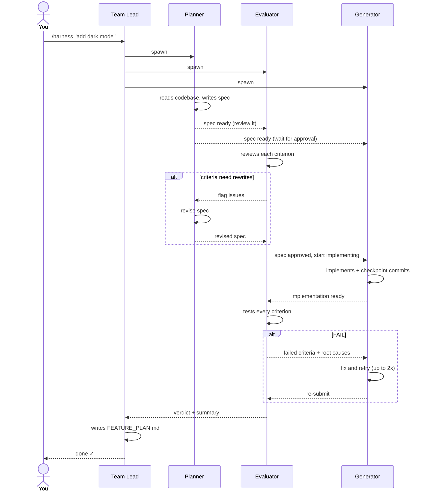

# agent-harness

A Claude Code plugin that spins up a **three-agent team** to plan and implement software features end-to-end — automatically.

Invoke it with `/harness` and describe what you want to build. Three specialized agents take it from there: one writes a product spec, one reviews it for testability, and one implements it. The evaluator then tests the result and sends it back for fixes if anything fails.

## Skills

| Skill | What it does |
|-------|-------------|
| `/harness` | Full end-to-end: spec → review → implement → evaluate |
| `/spec` | Spec + review only — no code written |
| `/debug` | Reproduce → diagnose root cause → fix + verify |
| `/iterate` | Resume a stopped or failed harness run |
| `/feature-log` | Show all harness and debug runs in the project |

---

## How `/harness` works



### The agents

**Planner** reads your codebase, writes a product spec with concrete acceptance criteria, and iterates with the Evaluator until every criterion is automatable and unambiguous.

**Evaluator** runs twice:
1. Before generation — reviews the spec for testability, flags vague criteria, forces rewrites
2. After generation — tests the implementation against each criterion using browser MCP tools, CLI, or API calls; writes a graded evaluation with root-cause analysis for failures

**Generator** waits for spec approval, implements the feature criterion-by-criterion with checkpoint commits, self-evaluates before handing off, and uses the Evaluator's root-cause analysis to fix failures strategically (not symptomatically).

### Output artifacts

All output lands in `.features/{team-name}/` in your project:

| File | Written by | Contents |
|------|-----------|----------|
| `FEATURE_SPEC.md` | Planner | Product spec + acceptance criteria |
| `SPEC_REVIEW.md` | Evaluator | Testability review + testing notes |
| `CHECKPOINT.md` | Generator | Progress log + key decisions |
| `EVALUATION.md` | Evaluator | Graded criteria + root causes |
| `FEATURE_PLAN.md` | Team Lead | Final summary of everything |

## Prerequisites

Agent Teams must be enabled in `~/.claude/settings.json`:

```json
{
  "env": {
    "CLAUDE_CODE_EXPERIMENTAL_AGENT_TEAMS": "1"
  }
}
```

If it's missing, Claude will add it and prompt you to restart.

## Installation

```bash
claude plugin install https://github.com/isaiahbernados/agent-harness
```

Then restart Claude Code. The `/harness` skill will be available in any project.

## Usage

### `/harness` — build a feature end-to-end
```
/harness add a search bar that filters the product list in real time
/harness build a CSV export button for the reports table
/harness implement OAuth login with GitHub
```
Triggers naturally on "build X", "implement X", "add X to the app".

### `/spec` — write a spec without building
```
/spec dark mode for the settings page
/spec a notification system with email and in-app alerts
```
Produces `FEATURE_SPEC.md` + `SPEC_REVIEW.md`. Run `/harness` with the same description when you're ready to implement.

### `/debug` — fix a bug
```
/debug the login form submits even when the password field is empty
/debug search results don't update after the first query
```
Writes a failing test, traces the root cause to a specific file and line, then implements and verifies the fix.

### `/iterate` — resume a stopped run
```
/iterate feat-dark-mode
/iterate
```
Without a team name, lists all in-progress runs for you to pick from.

### `/feature-log` — project history
```
/feature-log
```
Renders a table of all harness and debug runs in the current project with their status and summaries.

### Retry behavior

If the Evaluator finds failures, the Generator gets the failed criteria plus root-cause analysis and retries automatically — up to 2 times. If still failing, Claude surfaces the situation and asks how you'd like to proceed.

## Why a spec-first loop?

LLMs tend to write code that *looks* right but fails on edge cases the prompt didn't mention. By forcing a written spec through a testability gate before a single line of code is written, the harness:

- Catches vague requirements early (before the Generator wastes time on them)
- Gives the Generator a precise, graded checklist to work from
- Gives the Evaluator objective criteria to test against — no subjective judgment calls
- Produces a paper trail (`.features/`) that survives context resets

## License

MIT
